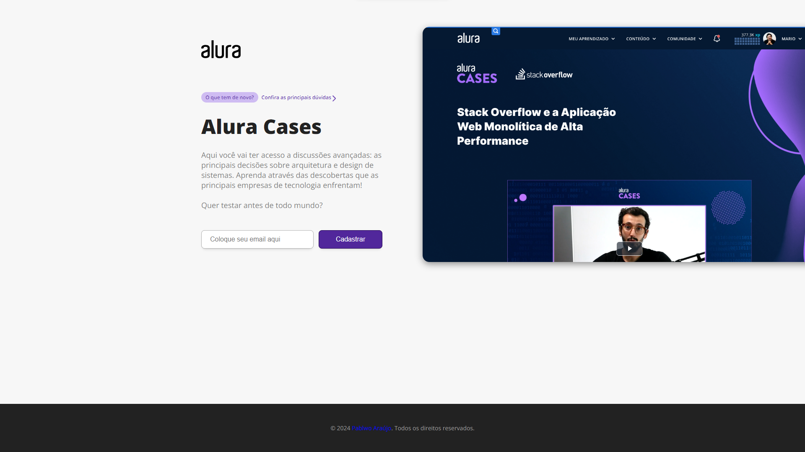
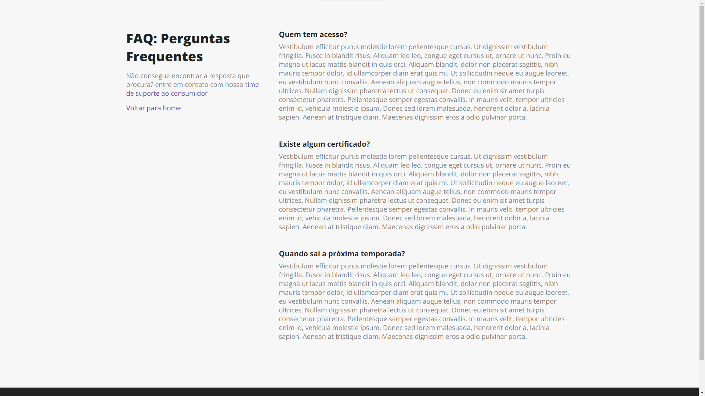

# alura-cases
Hotsite - [Alura Cases!](alura-cases-blond.vercel.app) (Curso de Next.js: explorando o framework)

## 📋 Índice
- [🚀 Tecnologias utilizadas](#-Tecnologias-utilizadas)
- [📌 Como executar o projeto](#-Como-executar-o-projeto)
- [💻 Preview](#-Preview)
- [📌 Créditos](#-Créditos)
- [🎓 Certificado](#-Certificado)

## 🚀 Tecnologias utilizadas
O projeto foi desenvolvido utilizando a seguinte tecnologia:

- [Next.js](https://nextjs.org/)

## 📌 Como executar o projeto

```bash
# Clone o repositório
git clone https://github.com/pablwoAraujo/alura-cases.git

# Acesse o diretório
cd alura-cases/

# Execute o comando para baixar as dependências do projeto;
yarn install

# Execute o projeto em modo de desenvolvimento
yarn dev
```

## 💻 Preview

Home Page | FAQ Page
:----------------------:|:----------------------:
 | 

> Acesse o website: [alura-cases](alura-cases-blond.vercel.app)

## 📌 Créditos
  - [Curso de Next.js: explorando o framework](https://cursos.alura.com.br/course/next-js-iniciando-framework)
  - Professor [Mario Souto](https://github.com/omariosouto)

## 🎓 Certificado
  - [NEXT.JS: EXPLORANDO O FRAMEWORK](https://cursos.alura.com.br/certificate/2becd40e-95e1-4559-9600-f274a6393889?lang=pt_BR)